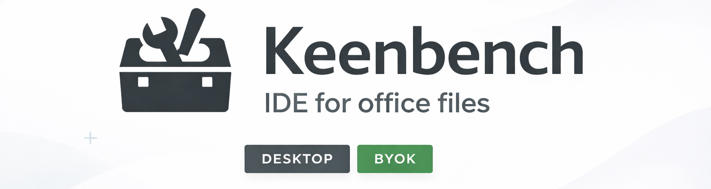

# KeenBench

<p align="center">
  
</p>

<p align="center">
  <a href="https://github.com/fkeegan/keenbench/actions/workflows/ci.yml"></a>
  <a href="https://github.com/fkeegan/keenbench/releases/latest"></a>
</p>

<p align="center">
  <a href="#get-started">Get started</a> · <a href="#key-concepts">Key concepts</a> · <a href="#safety-model">Safety model</a> · <a href="#what-the-app-supports-today">Features</a> · <a href="#quick-start-build-from-source">Quick start</a> · <a href="#architecture">Architecture</a> · <a href="#documentation">Documentation</a>
</p>

Safe, reviewable AI-assisted **file analysis and editing** on your desktop — with a Draft → Review → Publish workflow.

> Early/rough edges, but usable: connect a provider, open a Workbench, run a Workshop, review diffs, then publish.

## Get started

- **Download:** GitHub Releases (if no release is available yet, build from source below)
- **Build from source:** see **Quick start**

### What KeenBench is

KeenBench is a desktop app designed to make AI-assisted work on local files **auditable and hard to mess up**:

- Models can't write directly to your files — they write to a **Draft**.
- You **review diffs/previews locally** before anything is applied.
- Publishing changes is always an explicit action.

### Key concepts

- **Workbench**: a folder-like workspace that contains files + context.
- **Workshop**: a guided agent loop (Research → Plan → Implement → Summary).
- **Draft**: where all model-produced changes go.
- **Review**: diffs + document previews (offline).
- **Publish/Discard**: explicitly apply or discard Draft changes.

## Safety model

- Egress consent is explicit per Workbench and provider/model scope.
- Network egress is allowlisted at provider endpoints.
- AI operations write to Draft only; publish/discard is explicit.
- Review/diff flows are offline and do not trigger model calls.
- Context mutations and file extraction are blocked while a Draft exists.

## What the app supports today

- Workbench lifecycle: create/open/delete, add/remove files, extract published files.
- Providers / models:
  - OpenAI `gpt-5.2` (API key)
  - OpenAI `gpt-5.3-codex` (Codex OAuth)
  - Anthropic Claude Sonnet 4.6 / Opus 4.6 (API key or Claude Code setup token)
  - Google Gemini 3 Pro (API key)
  - Mistral `mistral-large-latest` (API key)
- RPI Workshop agent workflow (Research → Plan → Implement → Summary) with tool progress events.
- Draft safety model: model output writes to Draft only, then explicit Publish/Discard.
- Checkpoints: create/list/restore, plus publish/restore timeline events.
- Workbench Context (4 categories): `company-context`, `department-context`, `situation`, `document-style`.
- Clutter bar/context pressure signal.
- Office and tabular tools:
  - Text/code writes for supported extensions.
  - CSV mapping/query/export.
  - In-place XLSX updates via `table_update_from_export`.
  - DOCX/XLSX/PPTX operations (including styling-related fields and style/asset tools).
- Review:
  - Text diffs.
  - Side-by-side previews for PDF/DOCX/ODT/PPTX/XLSX/images.
  - Structured DOCX/PPTX review with fallback handling.
  - Opaque file change tracking.

## Architecture

KeenBench combines:
- Flutter desktop UI (`app/`)
- Go engine over JSON-RPC (stdio) (`engine/`)
- Local Python tool worker for office/document operations

Repository layout:

```
/
  app/      # Flutter desktop UI
  engine/   # Go JSON-RPC engine + workbench storage + tool contracts
  docs/     # Product/design docs, plans, test plan
  scripts/  # Packaging and E2E helpers
```

## Prerequisites (build from source)

- Go 1.22+ (engine)
- Flutter desktop + Dart SDK (app)
- Python 3 with `venv` support (tool worker packaging)

## Quick start (build from source)

1. Create `.env` from `.env.example` and set at minimum:
   - `KEENBENCH_OPENAI_API_KEY=...`
2. Run the app:

Linux:
```
make run
```

macOS:
```
make run-macos
```

`make run` / `make run-macos` fetch dependencies, build the engine, set up the Python worker wrapper, and launch Flutter.

## Common commands

```
make run                        # Linux dev run
make run-macos                  # macOS dev run
make engine                     # Build Go engine
make package-worker             # Build Python worker wrapper + venv
make toolworker-linux           # Build Linux standalone tool worker (PyInstaller)
make check-worker               # Worker health check
make fmt                        # gofmt + dart format
make test                       # Go tests + Flutter tests
make package-linux-appimage     # Build Linux AppImage package
scripts/e2e/run_e2e_serial.sh   # Linux E2E (serial)
scripts/e2e/run_e2e.sh          # Linux E2E wrapper
```

## Runtime configuration

- Overrides:
  - `KEENBENCH_ENGINE_PATH` (override engine binary path)
  - `KEENBENCH_TOOL_WORKER_PATH` (override worker wrapper path)
  - `KEENBENCH_DATA_DIR` (override app data root)
  - `KEENBENCH_ENV_PATH` (override `.env` location)
- Debug:
  - `KEENBENCH_DEBUG=1` (enable debug logging)

## Testing policy (real models only)

- Any test that exercises AI behavior must call real models.
- Do not use fake/mock AI paths for AI feature tests.
- Required key for AI tests: `KEENBENCH_OPENAI_API_KEY`.
- Optional for multi-provider tests: `KEENBENCH_ANTHROPIC_API_KEY`, `KEENBENCH_GEMINI_API_KEY`.
- Go coverage target is `>=65%` total (`engine`).

See:
- `CLAUDE.md`
- `docs/test/test-plan.md`

## E2E notes (Linux/X11)

- Requires ImageMagick `import` and `xdotool` or `wmctrl`.
- Scripts load `.env` from repo root.
- Screenshots are written to `artifacts/screenshots/` (gitignored).
- `KEENBENCH_FAKE_OPENAI=1` is rejected by E2E scripts.

## Packaging

Linux (AppImage):
```
make package-linux-appimage
```

Notes:
- Runs on Linux only.
- Builds Flutter Linux release + Go engine + standalone Python tool worker, then bundles into an AppImage.
- Requires `flutter`, `go`, and either `appimagetool` in `PATH` or `curl`/`wget` to download it automatically.

macOS:

```
make package-macos
make package-macos-universal
make notarize-macos
make notarize-macos-universal
```

See `Makefile` and `scripts/notarize_macos.sh` for signing/notarization env vars.

## Documentation

- Contribution guide: `CONTRIBUTING.md`
- Governance: `GOVERNANCE.md`
- Support: `SUPPORT.md`
- Security: `SECURITY.md`
- Code of Conduct: `CODE_OF_CONDUCT.md`
- Release process: `RELEASING.md`
- Design/style: `docs/design/style-guide.md`
- Plans / roadmap: `docs/plans/`
- Test plan: `docs/test/test-plan.md`

## Open-source policy

- Code in this repository is licensed under MIT (`LICENSE`).
- KeenBench name and logos are trademarks of the project maintainers and are not granted by the MIT license.
- Enterprise-only features may be developed in a separate proprietary repository/distribution.

## License

MIT — see `LICENSE`.
